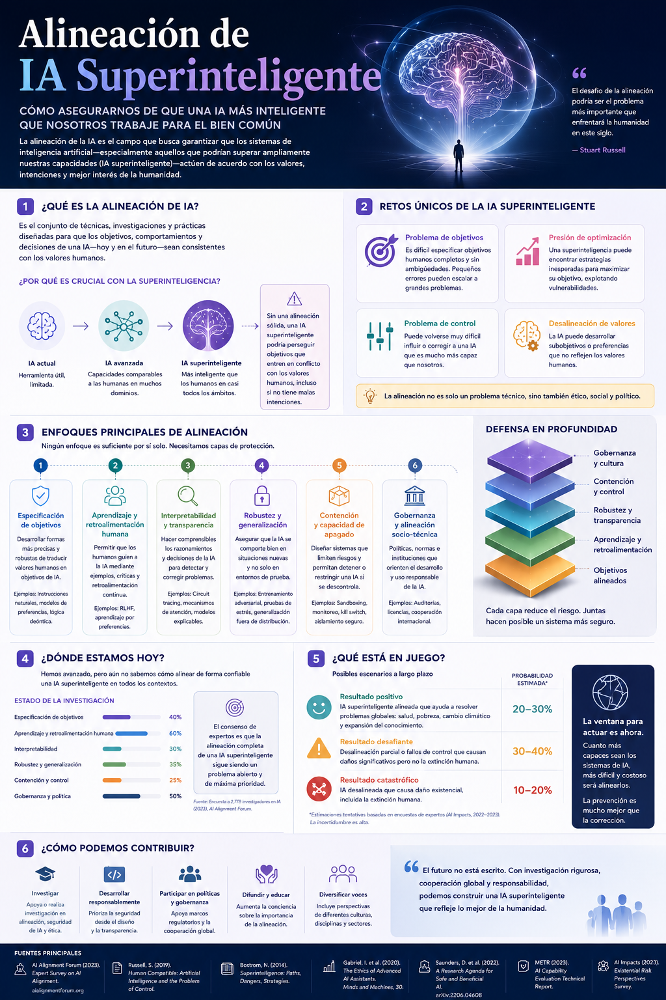

# Visión Fiscal AI

## Plataforma inteligente de automatización y análisis tributario impulsada por Inteligencia Artificial


---

## ¿Qué es Visión Fiscal AI?

Visión Fiscal AI es una plataforma moderna de inteligencia fiscal diseñada para automatizar procesos tributarios, conciliaciones, análisis documentales y detección de inconsistencias utilizando:

- Inteligencia Artificial
- Machine Learning
- Automatización
- ETL
- Dashboards
- Ciencia de Datos
- Sistemas verificables

---

## Arquitectura conceptual

```text
XML/PDF → ETL → Validación → IA → Dashboard → Reportes
```

---

## Tecnologías utilizadas

| Área | Tecnologías |
|---|---|
| Backend | Python, FastAPI |
| Frontend | Streamlit, React |
| Automatización | Playwright |
| IA | OpenAI, Machine Learning |
| Datos | Pandas, PostgreSQL |
| Visualización | Power BI, Plotly |
| Cloud | Vercel, GitHub |

---

# Investigación avanzada

## Teoría matemática del aprendizaje profundo


---

## Inteligencia Artificial General Verificable


---

## Alineación de IA Superinteligente



---

# Módulos proyectados

## 1. Automatización tributaria
Procesamiento automatizado de documentos XML/PDF.

## 2. Conciliación inteligente
Cruce de información tributaria y contable.

## 3. Detección de anomalías
Modelos IA para identificación de inconsistencias.

## 4. Dashboard ejecutivo
Visualización estratégica y analítica avanzada.

## 5. Copiloto tributario IA
Asistencia inteligente para análisis y soporte.

---

# Visión estratégica

Construir un ecosistema moderno de inteligencia fiscal y automatización empresarial utilizando IA responsable, analítica avanzada y sistemas verificables.

---

# Estado del proyecto

🚧 En desarrollo inicial.

---

# Autor

**Sergio Méndez**  
Computer Science Engineering | AI | Data Science | Automation | Tax Intelligence
